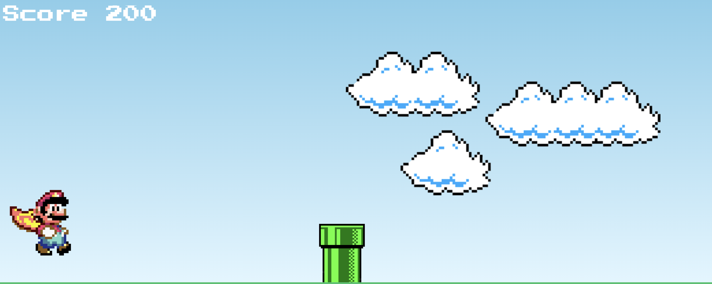

# mario_game

Baseado no [vídeo do Manual do Dev](https://www.youtube.com/watch?v=r9buAwVBDhA)

Código exemplo, precisa de refatoração nos css e js.

O jogo pode ser incrementado, sugestões:
- Pontuação pode ser exibida em moedas
- Novos inimigos
- Caixa com brindes para o Mario

